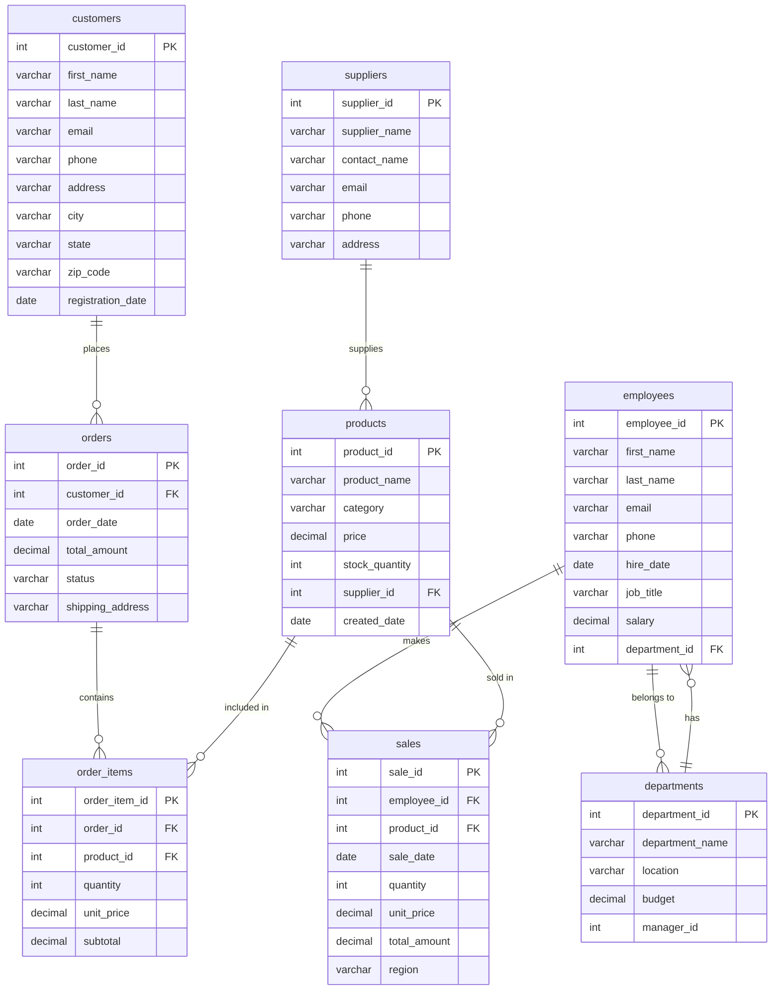

# Database ERD (Entity Relationship Diagram)

This document provides a visual representation of the database schema and relationships.

## Entity Relationship Diagram



## Table Relationships

### One-to-Many Relationships

1. **departments → employees**
   - One department has many employees
   - Foreign Key: `employees.department_id` → `departments.department_id`

2. **customers → orders**
   - One customer can place many orders
   - Foreign Key: `orders.customer_id` → `customers.customer_id`

3. **orders → order_items**
   - One order contains many order items
   - Foreign Key: `order_items.order_id` → `orders.order_id`

4. **products → order_items**
   - One product can appear in many order items
   - Foreign Key: `order_items.product_id` → `products.product_id`

5. **products → sales**
   - One product can have many sales records
   - Foreign Key: `sales.product_id` → `products.product_id`

6. **employees → sales**
   - One employee can make many sales
   - Foreign Key: `sales.employee_id` → `employees.employee_id`

7. **suppliers → products**
   - One supplier can supply many products
   - Foreign Key: `products.supplier_id` → `suppliers.supplier_id`

## Relationship Summary

```
departments (1) ──< (many) employees
employees (1) ──< (many) sales
customers (1) ──< (many) orders
orders (1) ──< (many) order_items
products (1) ──< (many) order_items
products (1) ──< (many) sales
suppliers (1) ──< (many) products
```

## Visualizing in PostgreSQL

### Using psql

```sql
-- Connect to database
psql -U postgres -d sql_mastery

-- List all tables with relationships
\dt

-- See table structure
\d employees

-- See foreign key constraints
SELECT
    tc.table_name, 
    kcu.column_name, 
    ccu.table_name AS foreign_table_name,
    ccu.column_name AS foreign_column_name 
FROM information_schema.table_constraints AS tc 
JOIN information_schema.key_column_usage AS kcu
  ON tc.constraint_name = kcu.constraint_name
JOIN information_schema.constraint_column_usage AS ccu
  ON ccu.constraint_name = tc.constraint_name
WHERE tc.constraint_type = 'FOREIGN KEY';
```

### Using pgAdmin

1. Open pgAdmin
2. Connect to your PostgreSQL server
3. Navigate to `sql_mastery` database
4. Right-click database → "Generate ERD"
5. View the visual diagram

### Using Online Tools

1. **dbdiagram.io**
   - Export schema: `pg_dump -s -U postgres sql_mastery > schema.sql`
   - Import to https://dbdiagram.io/
   - Auto-generates ERD

2. **SQLDBM**
   - Import PostgreSQL schema
   - Generates interactive ERD

## Key Relationships for Learning

### Level 4 (Joins) - Focus on these relationships:
- `employees` ↔ `departments` (department assignments)
- `orders` ↔ `customers` (customer orders)
- `orders` ↔ `order_items` ↔ `products` (order details)

### Level 5 (Subqueries) - Use these for practice:
- Employees and their departments
- Products and their suppliers
- Orders and customer information

### Level 6 (Advanced) - Complex relationships:
- Sales with employees and products
- Order items connecting orders and products
- Department hierarchies

---

**Tip**: Understanding these relationships is crucial for writing effective JOIN queries. Refer back to this diagram as you progress through the course!
